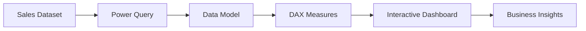

<div align="center">

# 📊 Business Sales & Profit Analytics Dashboard

### Enterprise Business Intelligence Solution using Microsoft Power BI

*An interactive Business Intelligence dashboard designed to analyze sales performance, profitability, regional trends, and product performance using modern data visualization and DAX-driven analytics.*


</div>

---

# 📖 Overview

Organizations generate large volumes of sales data every day, but raw numbers alone rarely provide meaningful business insights.

This project demonstrates how **Microsoft Power BI** can transform transactional sales data into an interactive Business Intelligence solution that enables stakeholders to monitor revenue, profitability, product performance, and regional trends through intuitive dashboards.

Rather than focusing solely on sales volume, the dashboard emphasizes **profitability analysis**, helping decision-makers identify where sustainable business growth is actually occurring.

---

# ✨ Dashboard Features

## 📈 Executive KPI Dashboard

Quick overview of key business metrics including:

- Total Sales
- Average Sales
- Total Profit
- Profit Margin

---

## 📊 Regional Sales Performance

Analyze sales trends across different regions over time.

Provides insights into:

- Regional growth
- Sales leadership
- Monthly performance comparison
- Trend evolution

---

## 🏷 Product Category Analysis

Visualizes revenue contribution by:

- Product Category
- Geographic Region
- Revenue distribution
- Sales concentration

---

## 💰 Profitability Analysis

Understand where profit is actually generated rather than simply where sales are highest.

Includes:

- Regional profitability
- Category profitability
- Profit contribution analysis
- Margin comparison

---

## 🎯 Target Performance Monitoring

Gauge visualization compares:

- Actual Profit Margin
- Target Margin
- Performance Gap

---

## 🎛 Interactive Filtering

Users can dynamically analyze the dashboard using slicers for:

- Region
- Product Category
- Profit Range

---

# 🏗 Dashboard Architecture



---

# 📸 Dashboard Preview

<p align="center">

</p>

---

# 🚀 Engineering Highlights

### ✔ Interactive Business Intelligence

Designed to support exploratory data analysis through fully interactive visuals and slicers.

---

### ✔ Strategic Visualization Selection

Charts were selected based on business communication rather than default visualization choices.

Examples include:

- Ribbon Chart to visualize changing regional rankings over time.
- Treemap to highlight proportional revenue contribution.
- Gauge Chart for performance against business targets.

---

### ✔ DAX-Based Metrics

Business calculations include:

- Average Sales
- Total Profit
- Profit Margin %
- KPI Aggregations

---

### ✔ Executive Dashboard Design

Focused on delivering decision-ready insights suitable for business managers and executives.

---

# 📊 Business Questions Answered

The dashboard enables stakeholders to answer questions such as:

- How are sales evolving over time?
- Which regions generate the highest revenue?
- Which product categories contribute the most profit?
- Does higher sales volume always translate into higher profitability?
- Are business targets being achieved?
- Which areas require management attention?

---

# 📈 Key Business Metrics

| KPI | Value |
|------|-------|
| Total Sales | ₹2 Million |
| Average Sale | ₹10.48K |
| Total Profit | ₹749K |
| Dashboard Type | Interactive |
| Slicers | Region, Category, Profit |

---

# 🛠 Technologies Used

| Layer | Technology |
|---------|------------|
| BI Tool | Microsoft Power BI |
| Data Modeling | Power Query |
| Calculations | DAX |
| Visualization | Interactive Reports |
| Analytics | Business Intelligence |

---

# 📂 Project Structure

```text
Business-Sales-Dashboard
│
├── business_dashboard.pbix
├── business-dashboard-screenshot.png
└── README.md
```

---

# 🎯 What This Project Demonstrates

✅ Business Intelligence

✅ Power BI Development

✅ Interactive Dashboard Design

✅ DAX Calculations

✅ Data Visualization

✅ KPI Reporting

✅ Executive Reporting

✅ Business Analytics

✅ Data Storytelling

---

# ⚙ Getting Started

Clone the repository

```bash
git clone https://github.com/yourusername/business-sales-dashboard.git
```

Open the project using **Microsoft Power BI Desktop**.

Interact with the dashboard using the available slicers to explore different business segments and performance metrics.

---

# 💡 Why This Project?

The objective was not simply to build another Power BI dashboard.

This project focuses on transforming raw sales data into actionable business intelligence by combining interactive visualizations, DAX calculations, and executive reporting techniques that support strategic decision-making.

It demonstrates how modern Business Intelligence tools can help organizations move beyond descriptive reporting toward meaningful analytical insights.

---

Interested in:

- Business Intelligence
- Data Analytics
- Power BI
- SQL
- Dashboard Engineering
- Data Visualization

---

<div align="center">

### ⭐ If you found this project useful, consider giving it a star!

Transforming data into actionable business insights through modern Business Intelligence.

</div>
