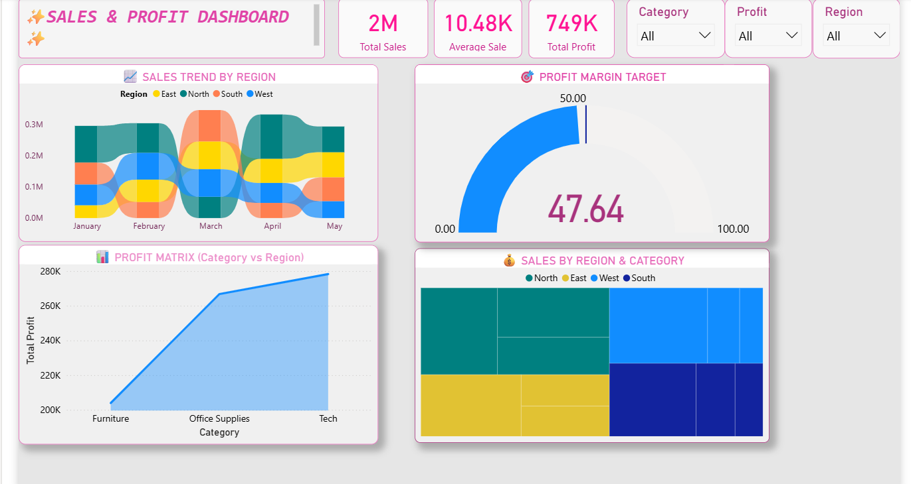

# Business Sales & Profit Dashboard (Power BI)

An interactive business performance dashboard analyzing sales, profit, and margin across regions and product categories built to track performance against targets and spot where profit is actually being made, not just where sales volume is highest.

---

##  Dashboard Preview

---

## Business Questions This Answers

- How are sales trending over time, broken down by region?
- Which region-category combinations generate the most revenue?
- Where is profit actually concentrated — does high sales volume always mean high profit?
- Are we hitting our profit margin target?

---

## What's on the Dashboard

- **KPI Cards**: Total Sales, Average Sale, Total Profit
- **Sales Trend by Region** (ribbon chart):- tracks which region leads in sales month over month, and how the lead changes over time
- **Sales by Region & Category** (treemap):- shows revenue concentration at a glance; bigger blocks = bigger revenue share
- **Profit Matrix: Category vs Region** (stacked area chart) :- shows how profit contribution shifts across categories and regions over time
- **Profit Margin Target** (gauge) :- tracks actual profit margin % against a target
- Interactive slicers for **Region**, **Category**, and **Profit** range

---

##  Key Insights
- Total Sales: 2 Million | Average Sale: 10.48k | Total Profit: 749k
---

##  Tools & Techniques

- **Power BI** — data modeling, DAX measures (Average Sale, Profit Margin %), report design
- **Chart selection strategy**: chose a ribbon chart over a standard line chart specifically to show *rank changes* between regions over time, and a treemap over a bar chart to show proportion at a glance — deliberate visual choices, not defaults

---

##  Files

- `business_dashboard.pbix` — the Power BI file
- `business-dashboard-screenshot.png` — dashboard preview

---

##  How to View

1. Download `business_dashboard.pbix`
2. Open in [Power BI Desktop](https://powerbi.microsoft.com/desktop/) (free)
3. Use the Region/Category/Profit slicers to explore different segments

---

